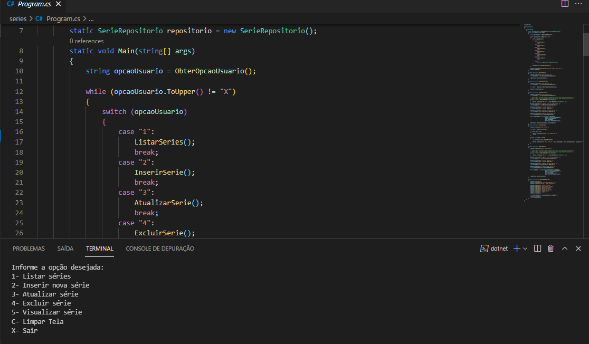

  

 

 ## 🚀 Tecnologias

- C# 
- .NET (framework)

## 💻 Projeto

Algoritimo de Séries , foi desenvolvido em linguagem em C# + .NET , foi apresentado e projetado pelo professor Eliézer Zarpelão na matéria "Criando Aplicação de Séries Simples em C#" na plataforma da DIO (Digital Innovation One).

Neste projeto, o algoritimo adiciona nome, ano, descrição e mostra lista das Séries cadastradas ao catálogo.

 
## 📝 Aprendizado - Anderson Nascimento

 Foi meu terceiro contato com a linguagem C# e o framework .NET , muito boa a experiência, concluído a etapa iniciante em C# . NET 😀

 
 ## 📝 Como Executar ??

 1)Baixar e instalar a biblioteca .NET SDK (caso ja possua, ignore)

 2)Acessar o diretório "Series-Csharp-.NET', utilizando o Visual Studio ou PowerShell e executar o comando:

 * dotnet run